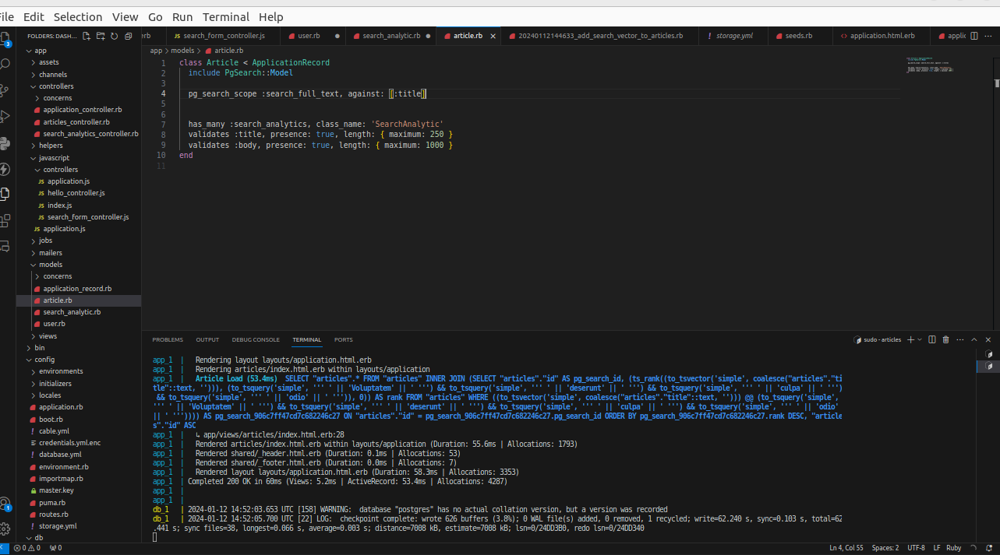
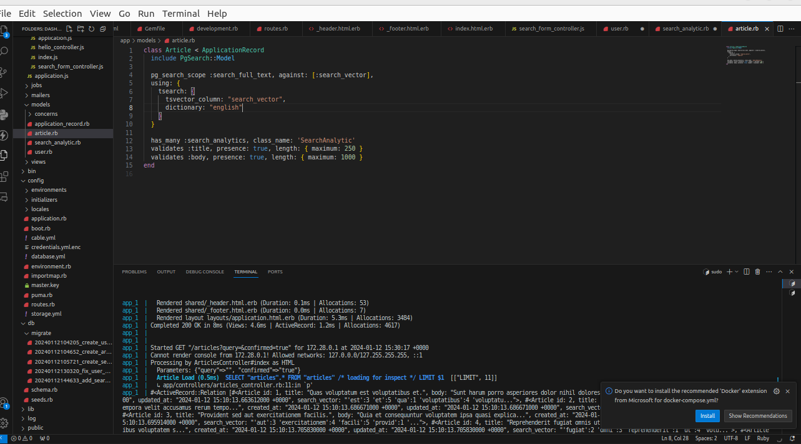

# Juice Search Engine

Juice Search Engine is a real-time search box application that empowers users to search for articles and provides insightful analytics on user search behavior. This project focuses on capturing and analyzing search input in real-time, recording analytics per user, and displaying trends to showcase what users are searching for the most. Buit for test project purpose.

## Features

1. **Real-time Search:** Users can input search queries, and the system captures and logs every search instantly.

2. **User Tracking:** Search analytics are recorded per user, ensuring that each user's data is kept separate.

3. **Instant Search:** The search functionality is designed to be fast and responsive.

4. **Analytics & Trends:** The system generates analytics and trends based on user search behavior.

## Built With

### Technologies

- Ruby on Rails
- Postgres
- JavaScript
- HTML and Bootstrap

### Tools

- Docker

### Gems

- [pg-search](https://github.com/Casecommons/pg_search) - Enables efficient search capabilities in PostgreSQL.
- [faker](https://github.com/faker-ruby/faker) - A library for generating fake data for testing.
- [fuzzy-string-match](https://github.com/seamusabshere/fuzzy-string-match) - Provides fuzzy string matching algorithms.
- [will-paginate](https://github.com/mislav/will_paginate) - Handles pagination of search results.
- [bootstrap](https://getbootstrap.com/) - Front-end framework for building responsive web applications.

## Getting Started
### Prerequisites
To set up and run this project locally:
- Ruby
- Ruby on Rails
- PostgrSQL
- Docker
### Setup
#### Install

1. Clone or download this repository. [Juice search engine](https://github.com/worashf/juice_search_engine)
2. cd to the forlder
3. Run `docker-compose` to install the packages.
4. Run `docker-compose up`


#### Configure database
In the root folder of the project, run the following:
 1. `docker-compose run app rails db:create`
 2. `docker-compose run app rails db:migrate`
 3. `docker-compose run app rails db:seed`

 #### Configure test database
To run the tests, configure it first:
.1. `docker-compose run test rails db:create`
 2. `docker-compose run test rails db:migrate`


# Usages

1. Open your browser and navigate to `http://localhost:3000` to access the application.

2. Visit the application and start searching for articles in the real-time search box.

# Tests

To run unit and integration tests, execute the following command in the root project's directory:

1. `docker-compose run test`


# Performance Optimization
In order to enhance the performance of the search functionality, I have implemented the following optimizations:
```class Article < ApplicationRecord
  include PgSearch::Model

  pg_search_scope :search_full_text, against: [:search_vector],
  using: {
    tsearch: {
      tsvector_column: "search_vector",
      dictionary: "english"
    }
  }

  has_many :search_analytics, class_name: 'SearchAnalytic'
  validates :title, presence: true, length: { maximum: 250 }
  validates :body, presence: true, length: { maximum: 1000 }
end
```


### Using pg-search Full-Text Features
The application now leverages the full-text search capabilities provided by the pg-search gem. This gem allows for efficient and powerful searches across large datasets.

### Vector Search
A vector column has been generated based on the article titles. This vector column is utilized to perform vector searches, enhancing the speed and accuracy of the search process.

### Indexing Vector Column
To further optimize search performance, the vector column has been indexed. Indexing helps speed up search operations by creating a data structure that allows for faster retrieval of information.

### Testing
The optimizations have been thoroughly tested, specifically with a dataset of 1000 articles. The goal was to ensure that the search functionality remains fast and responsive even with a substantial amount of data.

Before implementing vector search, the application took 54ms to search for an article from a pool of 1000 articles based on the title. You can observe this in the image below:



After incorporating vector search, the search time has significantly improved. It now takes only 0.5ms to search for an article from the same pool of 1000 articles based on the title. The enhanced performance is demonstrated in the image below:




# Authors

👤 **Worash Abocherugn**

- GitHub: [woashf](https://github.com/worashf)
- Twitter: [worash Aboche](https://twitter.com/WorashAboche)
- LinkedIn: [worash-Abocherugn](https://www.linkedin.com/in/worash-abocherugn/)


# Contributors

Contributions are welcome! If you want to contribute to this project, please follow the guidelines in [CONTRIBUTING.md](CONTRIBUTING.md). 🙏🙏🙏

# License

This project is licensed under the [MIT License](LICENSE)


## Acknowledgements

Takes [Helpjuice](https://helpjuice.com/), 🙏🙏🙏


